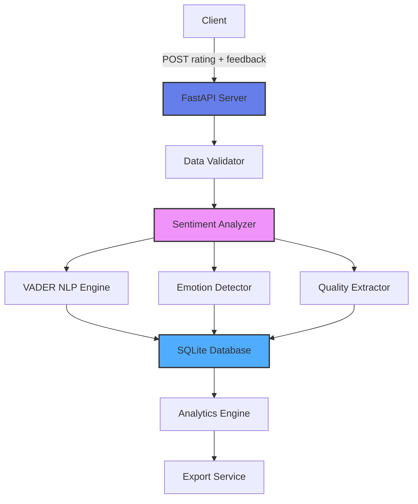

# 🤖 AI Conversation Quality & Sentiment Analysis System

[](https://www.python.org/)
[](https://fastapi.tiangolo.com/)
[](https://www.nltk.org/)
[](LICENSE)

A production-grade backend API for analyzing conversation quality using advanced NLP sentiment analysis. Combines numeric ratings (1-5 stars) with VADER sentiment analysis, emotion detection, and quality metrics extraction.

## 🎯 Project Overview

This system demonstrates ML operations and data engineering skills essential for building feedback systems in AI applications. It goes beyond simple ratings by analyzing the **emotional content** and **quality aspects** of user feedback - similar to systems used by Amazon Connect, chatbot platforms, and customer service applications.

**Perfect for:**
- AI/ML conversation systems
- Contact center quality monitoring
- Chatbot feedback analysis
- Customer service analytics
- RLHF (Reinforcement Learning from Human Feedback) data collection

## ✨ Features

### Advanced Sentiment Analysis
- **VADER Sentiment Scores**: Industry-standard NLP sentiment analysis
- **Emotion Detection**: Identifies joy, anger, sadness, fear, surprise, trust
- **Confidence Scoring**: Measures reliability of sentiment predictions
- **Hybrid Analysis**: Combines numeric ratings with text sentiment

### Quality Metrics Extraction
- **Speed Indicators**: Identifies mentions of response time
- **Helpfulness Metrics**: Extracts feedback on usefulness
- **Professionalism Tracking**: Detects courtesy and professionalism
- **Resolution Status**: Tracks problem resolution mentions

### Comprehensive Analytics
- **Rating Distribution**: Statistical breakdown of ratings
- **Sentiment Trends**: Track sentiment over time
- **Emotion Analysis**: Aggregate emotional patterns
- **Keyword Extraction**: Identify common themes in feedback

### Data Management
- **RESTful API**: Easy integration with any application
- **SQLite Database**: Persistent storage with indexing
- **Data Export**: JSON and CSV format support
- **Bulk Import**: Load historical data

## 🏗️ Architecture



## 🛠️ Tech Stack

- Framework: FastAPI (high-performance async Python)
- NLP Engine: NLTK with VADER sentiment analyzer
- Database: SQLite (production-ready upgrade to PostgreSQL)
- Validation: Pydantic models
- Analytics: Pandas for data analysis
- API Docs: Auto-generated OpenAPI/Swagger

## 📦 Installation
### Prerequisites

- Python 3.8 or higher
- pip

### Setup

1. Clone the repository
```
git clone https://github.com/yourusername/ai-conversation-sentiment-analyzer.git
cd ai-conversation-sentiment-analyzer

```

2. Install dependencies 
``` 
pip install -r requirements.txt
```

3. Run the server
```
python app.py
```

4. Access the API


- API: ``` http://localhost:8000```
- Interactive docs:``` http://localhost:8000/docs```
- Alternative docs:``` http://localhost:8000/redoc```

## 🚀 Usage

### Submit a Rating with Feedback
```
curl -X POST "http://localhost:8000/ratings" \
  -H "Content-Type: application/json" \
  -d '{
    "conversation_id": "conv_12345",
    "rating": 5,
    "feedback": "The support was absolutely fantastic! Very quick response and extremely helpful. The agent was professional and solved my issue immediately.",
    "user_id": "user_789",
    "metadata": {
      "agent_id": "agent_001",
      "duration_seconds": 180,
      "category": "technical_support"
    }
  }'
```

### Get Sentiment Analysis
```
# Get all ratings with sentiment
curl "http://localhost:8000/ratings?limit=10"

# Get detailed analytics
curl "http://localhost:8000/analytics/sentiment-summary"

# Get emotion analysis
curl "http://localhost:8000/analytics/emotions"

# Get quality metrics
curl "http://localhost:8000/analytics/quality-metrics"
```

### Analyze Text Only (No Rating)
```
curl -X POST "http://localhost:8000/analyze-text" \
  -H "Content-Type: application/json" \
  -d '{
    "text": "I am very disappointed with the slow response time. The service was unhelpful and unprofessional."
  }'
 ```

## 📊 API Endpoints
### Rating Operations

| Method | Endpoint | Description |
|--------|----------|-------------|
| POST | `/ratings` | Submit rating with sentiment analysis |
| GET | `/ratings` | Get all ratings with filters |
| GET | `/ratings/{id}` | Get specific rating with analysis |
| DELETE | `/ratings/{id}` | Delete a rating |

### Sentiment Analysis

| Method | Endpoint | Description |
|--------|----------|-------------|
| POST | `/analyze-text` | Analyze text without saving |
| GET | `/analytics/sentiment-summary` | Overall sentiment statistics |
| GET | `/analytics/emotions` | Emotion detection breakdown |
| GET | `/analytics/quality-metrics` | Quality aspect analysis |

### General Analytics

| Method | Endpoint | Description |
|--------|----------|-------------|
| GET | `/analytics/summary` | Overall rating statistics |
| GET | `/analytics/distribution` | Rating distribution |
| GET | `/analytics/trends` | Time-based trends |

### Data Export

| Method | Endpoint | Description |
|--------|----------|-------------|
| GET | `/export` | Export data (JSON/CSV) |
| POST | `/import` | Bulk import ratings |
 
## 📋 Example Responses

### POST /ratings

```
{
  "id": 1,
  "conversation_id": "conv_12345",
  "rating": 5,
  "feedback": "The support was absolutely fantastic! Very quick response...",
  "user_id": "user_789",
  "timestamp": "2025-01-05T10:30:00",
  "sentiment_analysis": {
    "sentiment": "positive",
    "confidence": 0.95,
    "vader_scores": {
      "positive": 0.456,
      "neutral": 0.344,
      "negative": 0.000,
      "compound": 0.8765
    },
    "emotions": ["joy", "trust"],
    "quality_aspects": {
      "speed": ["quick"],
      "helpfulness": ["helpful"],
      "professionalism": ["professional"]
    },
    "keywords": ["fantastic", "quick", "helpful", "professional", "solved"]
  }
}
```

### GET /analytics/sentiment-summary

```
{
  "total_ratings": 1547,
  "sentiment_distribution": {
    "positive": 1179,
    "neutral": 234,
    "negative": 134
  },
  "average_confidence": 0.87,
  "average_vader_compound": 0.42,
  "emotions_detected": {
    "joy": 856,
    "trust": 723,
    "anger": 98,
    "sadness": 67,
    "fear": 45,
    "surprise": 123
  }
}
```

### POST /analyze-text

```
{
  "sentiment": "negative",
  "confidence": 0.82,
  "vader_scores": {
    "positive": 0.000,
    "neutral": 0.345,
    "negative": 0.655,
    "compound": -0.7269
  },
  "emotions": ["anger", "sadness"],
  "quality_aspects": {
    "speed": ["slow"],
    "helpfulness": ["unhelpful"],
    "professionalism": ["unprofessional"]
  },
  "keywords": ["disappointed", "slow", "unhelpful", "unprofessional"]
}
```

### 📁 Project Structure
```
ai-conversation-sentiment-analyzer/
├── app.py                     # Main FastAPI application
├── sentiment_analyzer.py      # Advanced sentiment analysis engine
├── requirements.txt           # Python dependencies
├── test_system.py            # Test script with sample data
├── ratings.db                # SQLite database (auto-created)
├── README.md                 # This file
└── LICENSE                   # MIT License
```

##🎓 Skills Demonstrated
### NLP & Machine Learning
- ✅ Sentiment Analysis: VADER sentiment scoring
- ✅ Emotion Detection: Multi-class emotion recognition
- ✅ Text Processing: Keyword extraction and analysis
- ✅ Confidence Scoring: Prediction reliability metrics
### Backend Development
- ✅ RESTful API: Production-grade endpoints
- ✅ Data Validation: Pydantic type checking
- ✅ Async Programming: FastAPI async patterns
- ✅ Database Design: Efficient schema with indexes
### Data Engineering
- ✅ Data Pipeline: Rating → Analysis → Storage flow
- ✅ Feature Extraction: Quality metrics from text
- ✅ Analytics: Statistical aggregations
- ✅ Data Export: Multi-format support
### MLOps
- ✅ RLHF Pipeline: Human feedback collection
- ✅ Quality Monitoring: Track AI performance
- ✅ A/B Testing: Compare conversation strategies
- ✅ Training Data: Labeled sentiment data

## 🔍 Technical Highlights
### Hybrid Sentiment Analysis

```
def analyze(text, rating):
    """
    Combines VADER NLP sentiment with numeric rating
    - Uses VADER for text analysis
    - Incorporates star rating as signal
    - Detects emotions beyond positive/negative
    - Extracts quality indicators
    """
```

### Emotion Detection

```
emotion_keywords = {
    'joy': ['happy', 'great', 'excellent', 'wonderful'],
    'anger': ['angry', 'frustrated', 'terrible'],
    'sadness': ['sad', 'disappointed', 'poor'],
    'fear': ['worried', 'concerned', 'anxious'],
    'surprise': ['surprised', 'unexpected', 'shocked'],
    'trust': ['reliable', 'professional', 'helpful']
}
```

### Quality Metrics

```
quality_aspects = {
    'speed': ['quick', 'fast', 'slow', 'delayed'],
    'helpfulness': ['helpful', 'unhelpful', 'useful'],
    'professionalism': ['professional', 'courteous', 'rude'],
    'resolution': ['solved', 'resolved', 'unresolved']
}
```

## 🧪 Testing
### Quick Start Test

```
# Start the server
python app.py

# In another terminal, run the test script
python test_system.py
```

### Manual Testing

- Open browser: ``` http://localhost:8000/docs ```
- Try the "POST /ratings" endpoint
- Enter sample feedback text
- See instant sentiment analysis
- Check analytics endpoints

### Sample Test Data

```
# Positive feedback
curl -X POST "http://localhost:8000/ratings" \
  -H "Content-Type: application/json" \
  -d '{"conversation_id":"conv_001","rating":5,"feedback":"Excellent service! Very helpful and professional."}'

# Negative feedback
curl -X POST "http://localhost:8000/ratings" \
  -H "Content-Type: application/json" \
  -d '{"conversation_id":"conv_002","rating":2,"feedback":"Terrible experience. Slow response and unhelpful agent."}'

# Neutral feedback
curl -X POST "http://localhost:8000/ratings" \
  -H "Content-Type: application/json" \
  -d '{"conversation_id":"conv_003","rating":3,"feedback":"Average service. Nothing special but got the job done."}'
```  

## 📈 Use Cases
1. AI Chatbot Quality Monitoring
Track user satisfaction with AI responses and identify improvement areas.
2. Contact Center Performance
Analyze agent interactions and identify training opportunities.
3. RLHF Data Collection
Gather labeled preference data for training conversational AI models.
4. Product Feedback Analysis
Understand customer sentiment beyond star ratings.
5. A/B Testing AI Models
Compare user sentiment between different AI conversation strategies.

## 🚀 Future Enhancements

- Real-time sentiment tracking dashboard
- Multi-language sentiment support
- Custom emotion training
- Topic modeling with LDA
- Aspect-based sentiment analysis
- Integration with Slack/PagerDuty
- PostgreSQL migration
- Kubernetes deployment

## 📝 License
- MIT License - see LICENSE file
## 👤 Author
- Sanik Patige

- GitHub: @yourusername
